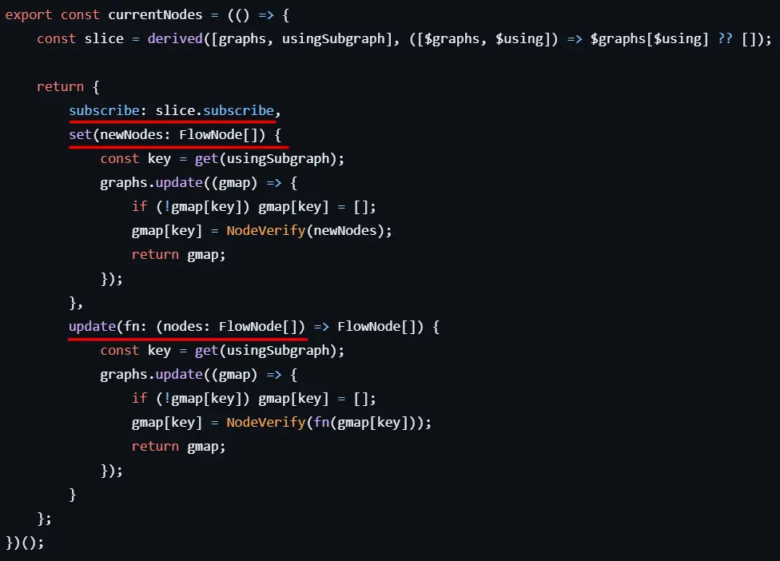
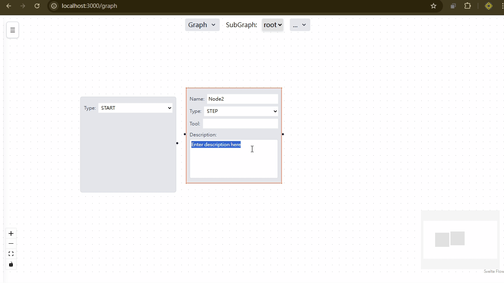

## Use SvelteFlow to Create AI Workflow Visualized Node-Edge Graph GUI Editor

## What I want

like dify, Coze, n8n.....

and self-host, more flexibity, use langgraph

* dify
  * 
* coze
  * 
* n8n
  * 

## Similar Base libs

But all of these not have official GUI, we need create by ourself.

## Why xyflow

use Node to represent Edges

xyflow is mature js graph library (svelteflow, reactflow)

* node design

## Choose ReactFlow

* React have large ecosystem and community
* Graph GUI with node edge design
* flexibity enough for make it as editor

## The Jourery of ReactFlow

LangGraph-GUI 1.0 using reactflow

* Hard to make SSOT
  * **ReactFlow not support signal-like logic**
  * hard to sync Redux and React Context
  * data update flow cannot align SSOT design
  * not only nodes, but also edges need update seperatly
* Code lines more longer

  

## Why SvelteFlow

* Svelte 5 using signals
  * code numbers usually fewer than react
  * easy to pass computed runes
* SvelteFlow 1.0 highly affinity svelt 5 rune, signals
* fewer and more beautiful lines

## Svelte is Elegant

[sample code](https://github.com/LangGraph-GUI/LangGraph-GUI-Svelte/blob/b56130696bc4e4202f3a4ffa013ef1a8d73aee35/src/routes/graph/flow/graphs.store.svelte.ts)

signal chain: **Node**(SSOT) --> **Edge** --> **SvelteFlow**

## Svelte is Elegant (cont.)

define your own signal object:

## Simple Demo

## END

Thank You

* Reference
  * reactflow, svelteflow websites
  * https://docs.crewai.com/en/introduction
  * https://www.js-craft.io/blog/langchain-vs-langgraph/
  * https://framerusercontent.com/images/7IPPObp2xkFVLH1IyW9QvFQ0a2I.gif
  * https://pbs.twimg.com/media/GP5rEiZaEAAUqWu?format=jpg&name=4096x4096
  * https://raw.githubusercontent.com/n8n-io/n8n/master/assets/n8n-screenshot-readme.png

<script src="https://posetmage.com/cdn/js/EmbedYoutubeVideo.js">
