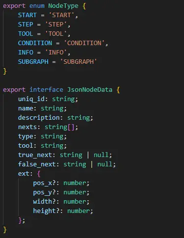

# LangGraph-GUI by SvelteFlow (ReactFlow)

## LangGraph-GUI

repo: [https://github.com/LangGraph-GUI/LangGraph-GUI](https://github.com/LangGraph-GUI/LangGraph-GUI)

## What I want

like dify, Coze, n8n.....

and self-host, more flexibity, use langgraph

* dify
  * 
* coze
  * 
* n8n
  * 

## What I want (LangGraph)

## My Design

* use Node to represent Edges
<iframe class="my-iframe" width="700" height="200" src="dataflow.html" style="background-color: white; display: inline;"></iframe>

* node design

## Choose ReactFlow

* React have large ecosystem and community
* Graph GUI with node edge design
* flexibity enough for make it as editor

## The Jourery of ReactFlow

[LangGraph-GUI-reactflow](https://github.com/LangGraph-GUI/LangGraph-GUI-reactflow)

<iframe class="my-iframe" width="700" height="400" src="redux.html" style="background-color: white; display: inline;"></iframe>

### Hard to make SSOT
* hard to sync Redux and Context
* data update flow cannot align SSOT design
* not only nodes, but also edges need update seperatly

### Conclusion
redux is not affinity with React

## Why SvelteFlow

* Svelte 5 is signals design
  * code numbers usually fewer than react
  * easy to pass computed runes
* SvelteFlow 1.0 highly affinity svelt 5
  * use rune, signals features

## Final Design
[LangGraph-GUI-Svelte](https://github.com/LangGraph-GUI/LangGraph-GUI-Svelte)

<iframe class="my-iframe" width="700" height="200" src="dataflow.html" style="background-color: white; display: inline;"></iframe>

* Nodes are SSOT
  * edges is readonly, nodes update will trigger edges
  * no need redux, just use writable

## END

Thank You

## Reference
* reactflow, svelteflow websites
* https://www.js-craft.io/blog/langchain-vs-langgraph/
* https://framerusercontent.com/images/7IPPObp2xkFVLH1IyW9QvFQ0a2I.gif
* https://pbs.twimg.com/media/GP5rEiZaEAAUqWu?format=jpg&name=4096x4096
* https://raw.githubusercontent.com/n8n-io/n8n/master/assets/n8n-screenshot-readme.png

