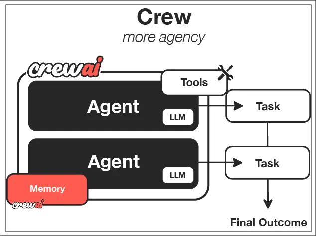
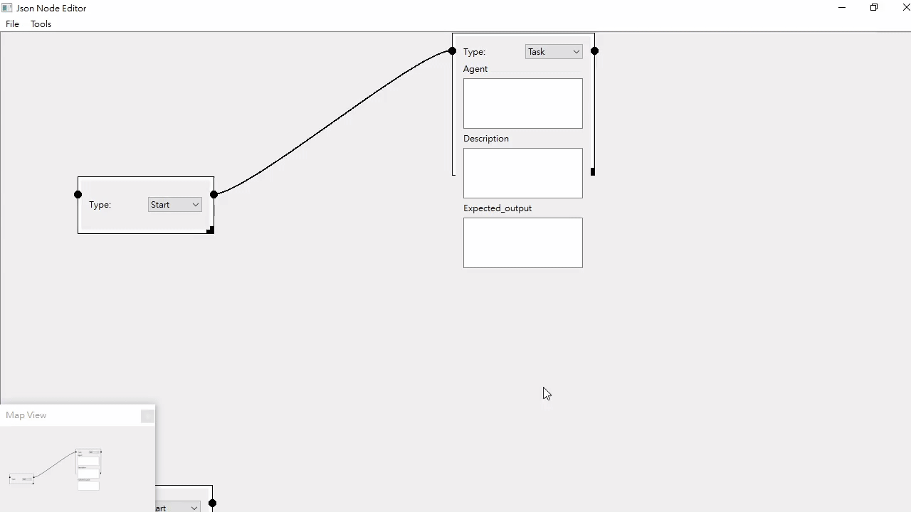
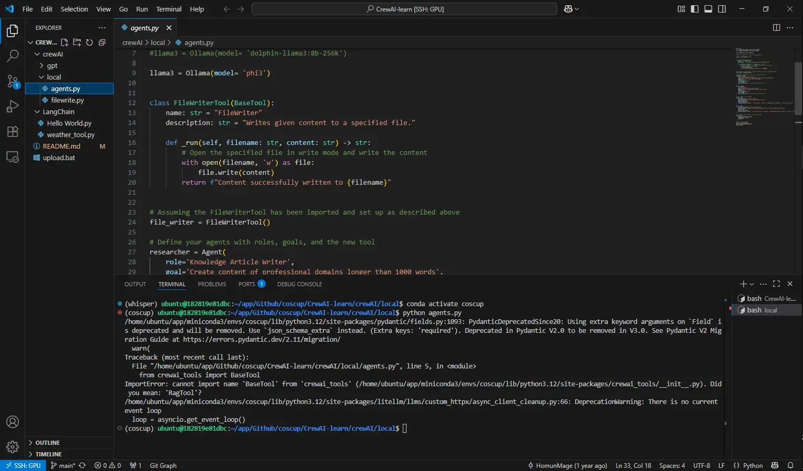
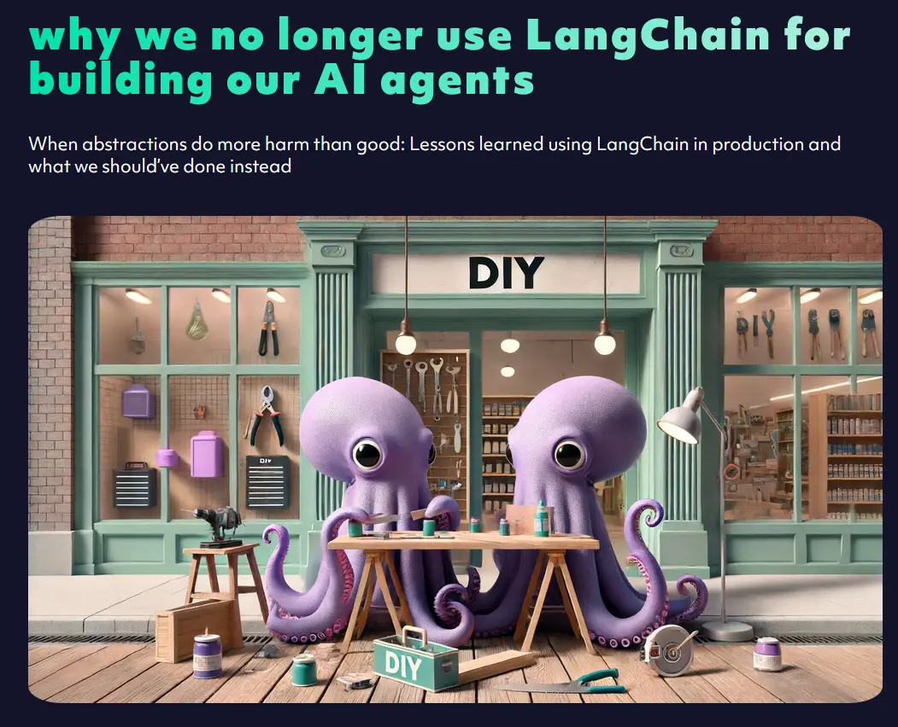

## Self-hosted AI Workflow Visualization with LangGraph-GUI & CrewAI-GUI

* Interactive, local-first GUIs for building and monitoring AI pipelines
* Fully customizable: swap models, agents, and frameworks
* Deployable via Docker Compose or Kubernetes

## LangGraph-GUI Demo

## Motivation & Goals

1. **Local GPU Support** (e.g., Ollama)
2. **Full Customization** of UI and backend logic
3. **LangGraph Compatibility** for flexible graph-based workflows
4. **Easy Deployment** with Docker Compose and Kubernetes

* Other similar software
  * dify
    * 
    * https://framerusercontent.com/images/7IPPObp2xkFVLH1IyW9QvFQ0a2I.gif
  * coze
    * 
    * https://pbs.twimg.com/media/GP5rEiZaEAAUqWu
  * n8n
    * 
    * https://raw.githubusercontent.com/n8n-io/n8n/master/assets/n8n-screenshot-readme.png

## First attempts - CrewAI-Qt

Build CrewAI-GUI with pyside6

## Why Not CrewAI?

* **Pros:** 
  * Beginner-friendly introduction to AI agents
  * LangGraph, LangChain resource not friendly to green hands
* **Cons:**

  * Abstracts too many steps (limited visibility)
  * Frequent updates may breaks existing code

## Why Not LangChain?

* **Modularity:** Tool usage is isolated, hard to combine
* **Fragility:** Breaking changes across versions
* **Abstraction:** Layers obscure data flow

[why we no longer use LangChain for building our AI agents](https://octomind.dev/blog/why-we-no-longer-use-langchain-for-building-our-ai-agents)

## Why Choose LangGraph

* **Graph-Centric Design**: Focus on nodes and edges
* **Model-Agnostic**: Plug in any LLM or agent
* **Composable**: Mix-and-match components seamlessly

* Learning Resource:
  * [LangGraph-GUI/LangGraph-learn](https://github.com/LangGraph-GUI/LangGraph-learn)

## Design of LangGraph-GUI

1. **JSON Contract**: text based, easy to decouple
2. **Frontend Agnostic**: ReactFlow, SvelteFlow, or custom
3. **Backend Flexible**: Python, etc.
4. **Extensible**: Add custom properties via `ext:` fields

## python backend

flask -> fastapi

Flask is friendly to beginner

FastAPI is better performance

## Thank You!

